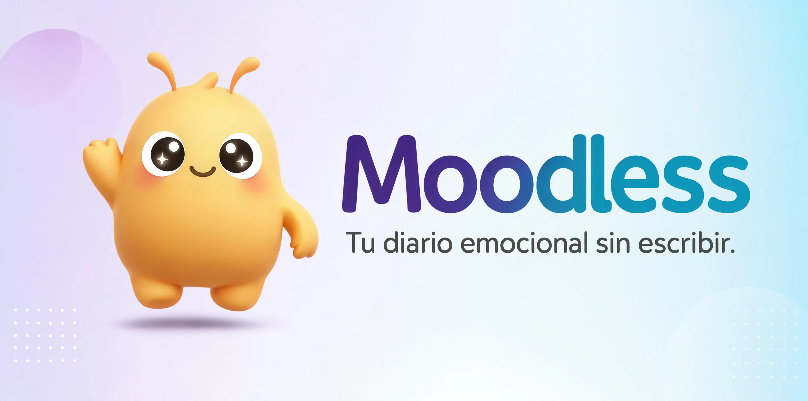

  

  <b>Un diario emocional con IA para entender cómo te sientes.</b>

  <a href="https://moodless.vercel.app">moodless.app</a>

---

## Claridad emocional, diseñada con IA.

Moodless es un diario visual que convierte pensamientos en comprensión.

Escribes.  
La IA interpreta.  
Tú entiendes.

---

## Qué hace

Moodless te ayuda a ver lo que normalmente no ves:

- emociones en el tiempo  
- patrones en tus pensamientos  
- evolución de tu estado mental  

---

## Experiencia

### ✍️ Escribir
Captura pensamientos de forma natural.

### 🧠 Entender
La IA analiza el tono emocional.

### 🎨 Visualizar
Cada entrada se convierte en una representación visual.

### 📊 Reflexionar
Descubre patrones con el tiempo.

---

## Principios

**Menos ruido. Más claridad.**  
Cada interacción tiene intención.

**La emoción es la interfaz.**  
No analizas datos. Te entiendes a ti mismo.

**Privacidad por defecto.**  
Tus pensamientos son tuyos.

---

## Stack

Next.js · React · Node.js · TailwindCSS · PostgreSQL · IA

---

## Estado

En desarrollo activo.

---

## Demo

https://moodless.app

---

## Visión

Construir una forma más natural de entender cómo pensamos.

---

## Licencia

Todos los derechos reservados.
